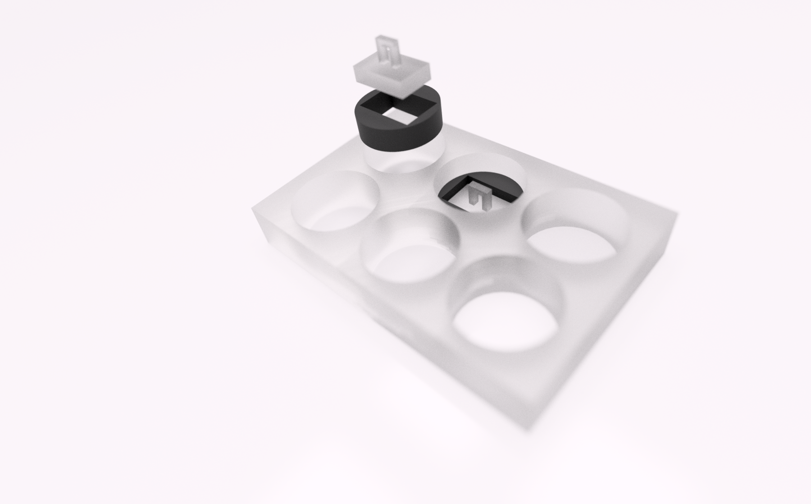
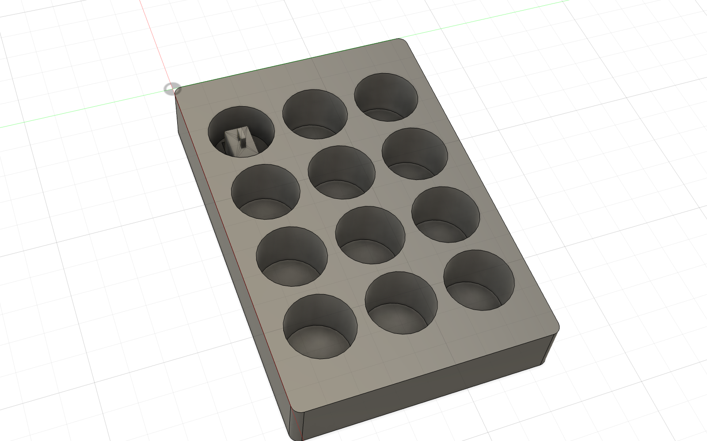

# 3D Printed Sample Holders

3D-printable sample holders used to mount FFPE tissue for volumetric cyclic
immunofluorescence imaging. Each holder consists of a **circular spacer** that
seats into a glass-bottom multiwell plate and a **glass stamp** (sample insert)
that carries the specimen against the coverslip.

Two formats are provided: a **6-well** version and a **12-well** version scaled
to the Cellvis 12-well glass-bottom plate (ANSI/SBS 1-2004).

## 6-well plate

| File | Description | Key dimensions |
| --- | --- | --- |
| `6-well_circular_spacer.stl` | Circular spacer disc that seats over a well and holds the stamp | Ø34.0 × 10.0 mm |
| `6-well_glass_stamp.stl` | Glass stamp / sample insert | 24.60 × 15.60 × 16.00 mm |
| `6-well_rendering.png` | Assembly rendering | — |

## 12-well plate

Scaled from the 6-well design by a uniform **0.588×** to fit the smaller well.
The glass stamp footprint is **0.522×** of the original, with its **main body
lengthened** so the assembly rests on the glass floor and the handle sits 1 mm
below the plate rim.

| File | Description | Key dimensions |
| --- | --- | --- |
| `12-well_circular_spacer.stl` | Circular spacer that seats inside a 12-well well | Ø20.0 × 5.88 mm — **1.0 mm** radial clearance to the Ø22.05 well |
| `12-well_glass_stamp.stl` | Glass stamp / sample insert (lengthened body) | 12.84 × 8.14 × **18.12 mm** — **0.2 mm** to window walls; rests on the glass floor, handle **1 mm** below the rim |
| `12-well_cellvis_reference.stl` | Dimensional reference of the Cellvis 12-well plate (reference only — not for printing) | 127.50 × 85.35 × 19.95 mm; 12 wells Ø22.05 @ 26 mm pitch (4×3) |
| `12-well_rendering.png` | Assembly view (spacer + stamp seated in well A1) | — |

### Reference plate specs (Cellvis 12-well, ANSI/SBS 1-2004)

- Footprint 127.50 × 85.35 mm, height 19.95 mm
- Well pitch 26.00 mm, well Ø ≈ 22.05 mm (bottom area 382 mm²)
- #1.5 glass-like polymer coverslip bottom (0.175 mm)

## 3D printing notes

- Both the **6-well** and **12-well Spacers** were printed on a **Dremel 3D45**
  using **translucent PETG** filament at **high quality (0.1 mm layer height)**
  settings.
- The fine internal features of the **12-well Spacer** are ~0.6–1.2 mm — verify
  printability before fabrication, as these approach the resolution limit at
  0.1 mm layer height.
- The 0.2 mm stamp clearance is measured to the nominal window walls; the
  **12-well Spacer** features protrude further, so confirm stamp/spacer
  interference for your application.
- Well and plate dimensions follow published Cellvis specifications; confirm
  against your specific plate lot before committing to glass.

## License and attribution

Designs by **Alex Wong** (Laboratory of Systems Pharmacology, Harvard Medical
School).

These design files are released under the **MIT License**, the same license as
this repository — see the top-level [`LICENSE`](../LICENSE). You are free to
use, reproduce, modify, and distribute them, provided attribution is retained.

If you use these holders in published work, please cite the associated
publication listed in the [repository README](../README.md).
