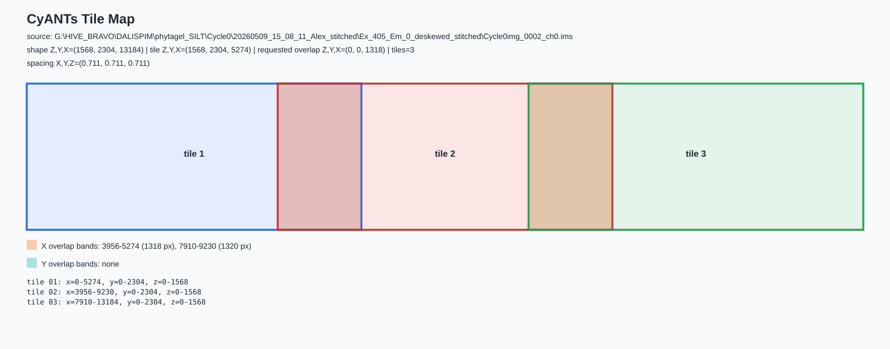

# CyANTs

CyANTs is an ANTsPy-based workflow for registering large multichannel CyCIF / light-sheet Imaris volumes. It supports:

- intra-cycle channel correction when channels shift relative to DAPI
- full-volume DAPI registration directly from `.ims` with streamed full-resolution TIFF output
- Imaris-ready channel naming for combining registered cycles into one `.ims`

Registration is performed with ANTsPy (`TRSAA`, rigid/affine stages, and SyN variants). Image reading, virtual tile extraction, and TIFF writing are implemented in Python with `h5py`, `SimpleITK`, and `tifffile`.

## Attribution and Citation

Developed by Alex Wong.

When using this workflow, please cite:

- **Volumetric Cyclic Immunofluorescence for 3D Spatial Profiling of Immune Structures in**. Preprint: [https://doi.org/10.64898/2026.05.17.725158](https://doi.org/10.64898/2026.05.17.725158)
- [ANTsX/ANTsPy](https://github.com/ANTsX/ANTsPy) for the registration method.

## Windows Environment

Recommended local folder and conda environment:

The repository name is `CyANTs`. This guide uses lowercase `C:\Users\Administrator1\Documents\cyants` as the local checkout folder and `cyants` as the conda environment name. If an existing checkout is stored under another folder name, either rename the folder once or replace the checkout path consistently in the commands below.

```bat
cd /d C:\Users\Administrator1\Documents\cyants
conda env create -f environment.yml
conda activate cyants
python -c "import ants, h5py, SimpleITK, tifffile; print('cyants environment ready')"
```

To update dependencies in an existing `cyants` environment:

```bat
conda activate cyants
python -m pip install -r requirements.txt
```

For later updates:

```bat
cd /d C:\Users\Administrator1\Documents\cyants && git pull && conda activate cyants
```

## Project Layout

You mostly provide paths in the command; the scripts create the project folders they write into.

```text
Reg\
  reference\
    roi\
      Cycle0_DAPI_fixed_crop.nrrd
  cycles\
    cycle_001\
      roi\
        XY_Coordinates.csv
      registration\
        run_0001\
          quicksyn_transforms\
          outputs\
          qc\
          logs\
      intracycle_whole_ims\
      whole_cycle_tiled_quicksyn\
        transforms\
        tile_quicksyn_transforms\
        stage_timing_cycle_tiled_quicksyn.json
        cycle_tiled_quicksyn_manifest.json
    cycle_002\
      ...
    cycle_003\
      ...
  whole_cycle_registered_fullres_imaris\
```

For whole-volume registration, Cycle0 is read directly from its original `.ims` path as the fixed reference. You do not need to create `reference\processed` or a full-volume fixed cache. The script creates each cycle's `--out` folder, `transforms`, `tile_quicksyn_transforms`, scratch folder, logs, manifests, and the shared `--final-out` TIFF folder.

For ROI registration, the moving-cycle folders are created automatically from `--proj`, `--cycle`, and `--run`. If the `--roi-csv` file is outside the project tree, the script copies it into `Reg\cycles\cycle_###\roi\XY_Coordinates.csv`. The only reference-side file you prepare once is the cached fixed DAPI crop under `Reg\reference\roi`, or you can pass its exact path with `--fixed-crop`.

Minimum inputs you provide in commands:

- `--fixed-ims`: original Cycle0 `.ims` for whole-volume registration.
- `--ims`: original moving-cycle `.ims`.
- `--proj`: project root for ROI runs.
- `--roi-csv`: Fiji/ImageJ ROI coordinate CSV for ROI runs.
- `--fixed-crop`: cached fixed DAPI ROI crop for ROI runs, unless there is exactly one valid crop under `Reg\reference\roi`.

## Main Scripts

| Script | Purpose |
|---|---|
| `vcycif_ROI.py` | Optional cached-reference ROI registration directly from moving `.ims` data |
| `ants_ims_intracycle_whole.py` | Correct whole-volume channel shift relative to DAPI within one cycle |
| `ants_ims_tiled_quicksyn.py` | Full-volume cycle-to-reference registration with streamed tiled output |
| `pad_tiff_stack.py` | Normalize TIFF dimensions when required |

## Voxel Spacing

For this dataset use isotropic spacing:

```text
0.711, 0.711, 0.711
```

Pass `--spacing 0.711` on all `.ims` workflows so written and transformed volumes use the intended physical spacing.

The full-volume workflow below reads `.ims` sources and corrected TIFF sources directly; it does not require an intermediate conversion step.

## Imaris Pyramid Levels

When a workflow reads a downsampled proxy from an `.ims` file, CyANTs now checks the built-in Imaris resolution pyramid first. If the requested stride matches an available `.ims` `ResolutionLevel`, CyANTs reads that lower-resolution dataset directly instead of reading level 0 and striding it in Python.

This applies automatically to whole-volume global registration, whole-volume QC previews, intracycle whole-volume proxies, and background checks. It does not change full-resolution output: final transformed tiles still read from the full-resolution source level.

For example, if the `.ims` contains levels that correspond to `2x`, `4x`, and `8x`, then `--global-ds 4` or `--qc-ds 4` can use the `4x` pyramid level directly. The terminal prints which path was used:

```text
[ims-pyramid] using ResolutionLevel 2 ... for requested stride_zyx=(4, 4, 4)
```

If no matching pyramid level exists, CyANTs falls back to the previous behavior:

```text
[ims-pyramid] no matching .ims pyramid level ... using direct strided read
```

To force the older direct-striding behavior for debugging:

```bat
set CYANTS_DISABLE_IMS_PYRAMID=1
```

```bash
export CYANTS_DISABLE_IMS_PYRAMID=1
```

## Channel Numbering

Do not assume every cycle has four channels. For both ROI and whole-volume registered TIFF output:

- `--ch` lists the source channels that actually exist and should be exported.
- `--co` is the first Imaris output channel number for that cycle.
- Selected source channels are packed consecutively from `--co`, regardless of their original channel numbers.
- The next cycle's `--co` equals the previous cycle's `--co` plus the number of channels actually exported.

Examples:

| Command | Output Mapping |
|---|---|
| `--ch 0-3 --co 0` | `ch0 -> C000`, `ch1 -> C001`, `ch2 -> C002`, `ch3 -> C003` |
| `--ch 0,1 --co 4` | `ch0 -> C004`, `ch1 -> C005` |
| `--ch 0,2,3 --co 6` | `ch0 -> C006`, `ch2 -> C007`, `ch3 -> C008` |

The terminal and run manifest print `output_channel_map`, for example:

```text
output_channel_map={0: 4, 1: 5}
```

## Optional Cached ROI Workflow

Use `vcycif_ROI.py` when you want to register a selected ROI rather than the whole volume. This is the fastest path for repeated ROI work: the fixed Cycle0 DAPI crop is cached once, while every moving-cycle ROI and marker channel is extracted directly from the source `.ims` file using Fiji/ImageJ `XY_Coordinates.csv`.

ROI TIFF channels follow the channel numbering rule above. Change `--ch` and `--co` for each cycle according to the channels present and the previous exported channel count.

### ROI Folder Layout

```text
Reg\
  reference\
    roi\
      Cycle0_DAPI_fixed_crop.nrrd
  cycles\
    cycle_001\
      roi\
        XY_Coordinates.csv
      registration\
        run_0001\
          quicksyn_transforms\
          outputs\
          qc\
          logs\
    cycle_002\
      roi\
        XY_Coordinates.csv
```

The script creates the moving-cycle `roi`, `registration`, `outputs`, `qc`, and `logs` folders automatically. The only fixed input you prepare once is the cached Cycle0 DAPI crop under `Reg\reference\roi`.

### Step 1: Save The Fixed Reference Crop Once

Open the Cycle0 DAPI/reference image in Fiji and crop the fixed ROI you want all cycles registered into. Save that cropped fixed DAPI image under:

```text
G:\HIVE_BRAVO\DALISPIM\phytagel_SILT\Reg\reference\roi\
```

Use a filename that is easy to recognize, for example:

```text
Cycle0_DAPI_fixed_crop.nrrd
```

The fixed crop may be `.nrrd`, `.tif`, or `.tiff`. NRRD is useful if you already verified ANTs spacing/geometry; TIFF is fine if spacing is supplied with `--spacing 0.711`.

### Step 2: Place The Moving-Cycle ROI In Fiji/ImageJ

For each moving cycle, create an `XY_Coordinates.csv` from the full image coordinate system:

1. Open that cycle's DAPI channel in Fiji/ImageJ.
2. Draw the ROI around the matching region in that moving cycle.
3. Right-click the ROI and choose `Properties`.
4. Check `List coordinates`.
5. Save the coordinates table as `XY_Coordinates.csv`.
6. Put the CSV in the matching cycle folder, for example:

```text
G:\HIVE_BRAVO\DALISPIM\phytagel_SILT\Reg\cycles\cycle_003\roi\XY_Coordinates.csv
```

The saved CSV uses full-resolution original `.ims` coordinates and has the same simple Fiji/ImageJ table format:

```text
X,Y
4824,138
7170,138
7170,2268
4824,2268
```

Only X/Y corners are needed. No Z range is needed by default; the ROI extractor uses the full available Z depth for that moving cycle.

The CSV should contain full-image `X,Y` pixel coordinates like:

```text
X,Y
4824,138
7170,138
7170,2268
4824,2268
```

Do not save coordinates from a cropped Fiji window if the coordinates were reset to the cropped image origin. The script uses these coordinates to extract the ROI from the original `.ims`, so they must refer to the moving cycle's full source image.

### Step 3: Run ROI Registration And Channel Application

This command extracts Cycle3 ROI channels directly from the `.ims`, registers DAPI to the cached fixed crop, applies the DAPI transform to the selected channels, and writes Imaris-ready registered TIFFs:

```bat
cd /d C:\Users\Administrator1\Documents\cyants && conda activate cyants && python "vcycif_ROI.py" --proj "G:\HIVE_BRAVO\DALISPIM\phytagel_SILT\Reg" --cycle cycle_003 --ims "G:\HIVE_BRAVO\DALISPIM\phytagel_SILT\Cycle3\20260524_11_16_14_P137_e142_phytagel_CD45_CD23_cD21_stitched\Ex_405_Em_0_deskewed_stitched\img_0002_ch0.ims" --roi-csv "G:\HIVE_BRAVO\DALISPIM\phytagel_SILT\Reg\cycles\cycle_003\roi\XY_Coordinates.csv" --fixed-crop "G:\HIVE_BRAVO\DALISPIM\phytagel_SILT\Reg\reference\roi\Cycle0img_0002_ch0_level0-1.nrrd" --ch 0-3 --co 0 --ds 4 --spacing 0.711 --t 32 --pi 30 --reg-format tif --u16 clip --tif-prefix cycle_003_roi_registered --open-qc
```

If Cycle3 has only two channels, use the channels that actually exist:

```bat
cd /d C:\Users\Administrator1\Documents\cyants && conda activate cyants && python "vcycif_ROI.py" --proj "G:\HIVE_BRAVO\DALISPIM\phytagel_SILT\Reg" --cycle cycle_003 --ims "G:\HIVE_BRAVO\DALISPIM\phytagel_SILT\Cycle3\20260524_11_16_14_P137_e142_phytagel_CD45_CD23_cD21_stitched\Ex_405_Em_0_deskewed_stitched\img_0002_ch0.ims" --roi-csv "G:\HIVE_BRAVO\DALISPIM\phytagel_SILT\Reg\cycles\cycle_003\roi\XY_Coordinates.csv" --fixed-crop "G:\HIVE_BRAVO\DALISPIM\phytagel_SILT\Reg\reference\roi\Cycle0_DAPI_fixed_crop.nrrd" --ch 0,1 --co 4 --ds 4 --spacing 0.711 --t 32 --pi 30 --reg-format tif --u16 clip --tif-prefix cycle_003_roi_registered --open-qc
```

### What The Script Does

1. Copies `XY_Coordinates.csv` into the standard cycle `roi` folder if needed.
2. Loads the cached fixed DAPI crop.
3. Extracts the moving DAPI ROI directly from the `.ims`.
4. Downsamples fixed and moving DAPI ROIs in memory.
5. Runs ANTs DAPI registration.
6. Extracts each requested marker channel ROI directly from the `.ims`.
7. Applies the DAPI transform to each extracted channel.
8. Writes registered output TIFFs as `uint16`.
9. Writes DAPI center-slice QC and similarity metrics.

Raw unregistered ROI volumes are kept in memory by default. Add `--save-raw-roi` only for debugging.

### ROI Outputs

For `--ch 0-3 --co 0 --tif-prefix cycle_003_roi_registered`, outputs are:

```text
Reg\cycles\cycle_003\registration\run_0001\
  quicksyn_transforms\
    roi_similarity_metrics.json
  outputs\
    cycle_003_roi_registered_C000.tif
    cycle_003_roi_registered_C001.tif
    cycle_003_roi_registered_C002.tif
    cycle_003_roi_registered_C003.tif
  qc\
    cycle_003_dapi_center_slices_overlay.png
  logs\
    direct_roi_cycle_manifest.json
    stage_timing_direct_roi_cycle.json
```

For `--ch 0,1 --co 4`, outputs are compact:

```text
cycle_003_roi_registered_C004.tif
cycle_003_roi_registered_C005.tif
```

## Whole-Volume Intra-Cycle Channel Correction

Use this when a channel is displaced relative to DAPI within the same original cycle. It estimates a whole-volume ANTs transform on a downsampled proxy, then streams its application to a full-resolution BigTIFF.

Example: correct Cycle1 channel 1 to channel 0:

```bat
cd /d C:\Users\Administrator1\Documents\cyants && conda activate cyants && python "ants_ims_intracycle_whole.py" --ims "G:\HIVE_BRAVO\DALISPIM\phytagel_SILT\Cycle1\20260514_15_53_54_p137_e142_Phytagel_SILT_stitched\Ex_405_Em_0_deskewed_stitched\img_0002_ch0_1.ims" --ref-ch 0 --ch 1 --out "G:\HIVE_BRAVO\DALISPIM\phytagel_SILT\Reg\cycles\cycle_001\intracycle_whole_ims" --tx TRSAA --ds 16 --full-tif --spacing 0.711 --t 32 --pi 30 --cz 8 --mxy 512 --mz 16 --uint16-scaling clip
```

Use the corrected TIFF as a `--source-map` override in full-volume cycle-to-reference registration.

If channels are stored as separate `.ims` files, keep the reference path in `--ref-ims` and map the moving channel label to its own file with `--source-map`:

```bat
python "ants_ims_intracycle_whole.py" --ims "G:\path\reference_ch0.ims" --ref-ims "G:\path\reference_ch0.ims" --ref-ch 0 --ch 2 --source-map "2=G:\path\moving_ch2.ims" --out "G:\path\Reg\cycles\cycle_004\intracycle_whole_ims" --tx TRSAA --ds 16 --full-tif --spacing 0.711 --t 32 --pi 30 --cz 8 --mxy 512 --mz 16 --uint16-scaling clip
```

## Global Whole-Volume Preview

Before a long tiled full-resolution run, use `--global-only` to evaluate the DAPI alignment on a downsampled whole-volume proxy. This writes downsampled before/registered TIFFs, center-slice overlay QC, similarity metrics, transforms, and timing output; it does not run tiles or write a full-resolution registered volume.

Example: Cycle1 global QuickSyN preview at `16x`:

```bat
cd /d C:\Users\Administrator1\Documents\cyants && git pull && conda activate cyants && python "ants_ims_tiled_quicksyn.py" --fixed-ims "G:\HIVE_BRAVO\DALISPIM\phytagel_SILT\Cycle0\20260509_15_08_11_Alex_stitched\Ex_405_Em_0_deskewed_stitched\Cycle0img_0002_ch0.ims" --ims "G:\HIVE_BRAVO\DALISPIM\phytagel_SILT\Cycle1\20260514_15_53_54_p137_e142_Phytagel_SILT_stitched\Ex_405_Em_0_deskewed_stitched\img_0002_ch0_1.ims" --ref-ch 0 --reg-ch 0 --ch 0 --out "G:\HIVE_BRAVO\DALISPIM\phytagel_SILT\Reg\cycles\cycle_001\global_quicksyn_preview_ds16" --global-only --global-tx QuickSyN --global-ds 16 --force-global --spacing 0.711 --t 32 --pi 30 --open-qc
```

Outputs are saved under:

```text
Reg\cycles\cycle_001\global_quicksyn_preview_ds16\
  global_preview\
    *_fixed.tif
    *_before.tif
    *_registered.tif
    *_similarity_metrics.json
    qc\
      *_center_slices_overlay.png
  transforms\
  global_preview_manifest.json
  stage_timing_global_preview.json
```

## Full-Resolution Tiled Registration

### Approach

For each moving cycle:

1. Register moving DAPI to Cycle0 DAPI with global `TRSAA` on a `16x` proxy.
2. Reuse the global transform automatically when its manifest already exists.
3. Use full-Z XY tiles for local DAPI refinement, so there are no tile seams through Z.
4. Run local `SyNOnly` after global alignment; this avoids repeating rigid/affine initialization within already-positioned tiles.
5. Apply the saved DAPI transform fields to every selected full-resolution channel.
6. Overlap-blend transformed XY tiles and stream final `uint16` BigTIFFs.

Recommended final-output settings:

```text
--trsaa-ds 16 --tile-ds 4 --full-z --tile 96,2048,2048 --overlap 0,512,512 --syn-tx SyNOnly
```

`--full-z` overrides the Z value supplied to `--tile` with the source depth. For the current reference that makes each tile `1568 x 2048 x 2048` at full resolution and approximately `392 x 512 x 512` during `4x` local registration.

You can also let CyANTs compute the full-Z XY tile layout from metadata. This is the recommended way to choose a tiled run before committing to a long registration:

- `--tiles N` asks for `N` total full-Z XY tiles. CyANTs reads the image size from the `.ims` metadata and chooses an XY grid from the aspect ratio.
- `--overlap 0.25` means neighboring tiles overlap by about 25% of the computed tile size.
- `--overlap z,y,x` still works for manual pixel overlap when you are also using manual `--tile z,y,x`.
- `--map` writes `tile_map\tile_map_xy.svg` and `tile_map\tile_map_xy.json`, opens the SVG unless the session is headless, and exits before loading image volumes or running ANTs.

Example tile map for `--tiles 3 --overlap 0.25`:



Generate the map first:

```bat
cd /d C:\Users\Administrator1\Documents\cyants && git pull && conda activate cyants && python "ants_ims_tiled_quicksyn.py" --fixed-ims "G:\HIVE_BRAVO\DALISPIM\phytagel_SILT\Cycle0\20260509_15_08_11_Alex_stitched\Ex_405_Em_0_deskewed_stitched\Cycle0img_0002_ch0.ims" --ims "G:\HIVE_BRAVO\DALISPIM\phytagel_SILT\Cycle1\20260514_15_53_54_p137_e142_Phytagel_SILT_stitched\Ex_405_Em_0_deskewed_stitched\img_0002_ch0_1.ims" --ref-ch 0 --reg-ch 0 --ch 0 --out "G:\HIVE_BRAVO\DALISPIM\phytagel_SILT\Reg\cycles\cycle_001\tile_map_3tiles_o25" --tiles 3 --overlap 0.25 --spacing 0.711 --map
```

Then run DAPI only first, with each local tile registration performed on a `6x` downsampled tile:

```bat
cd /d C:\Users\Administrator1\Documents\cyants && git pull && conda activate cyants && python "ants_ims_tiled_quicksyn.py" --fixed-ims "G:\HIVE_BRAVO\DALISPIM\phytagel_SILT\Cycle0\20260509_15_08_11_Alex_stitched\Ex_405_Em_0_deskewed_stitched\Cycle0img_0002_ch0.ims" --ims "G:\HIVE_BRAVO\DALISPIM\phytagel_SILT\Cycle1\20260514_15_53_54_p137_e142_Phytagel_SILT_stitched\Ex_405_Em_0_deskewed_stitched\img_0002_ch0_1.ims" --ref-ch 0 --reg-ch 0 --ch 0 --out "G:\HIVE_BRAVO\DALISPIM\phytagel_SILT\Reg\cycles\cycle_001\whole_cycle_tiled_quicksyn_3tiles_o25_ds6" --global-tx TRSAA --global-ds 16 --global-qc --tiles 3 --overlap 0.25 --tile-ds 6 --mxy 512 --mz 16 --syn-tx SyNOnly --spacing 0.711 --t 32 --pi 30 --blend ram --ram-limit-gb 1500 --qc --qc-ds 16 --open-qc
```

Do not use `--skip-bg-tiles` for final multichannel exports unless you intentionally want low-DAPI regions removed from all channels. Without it, locally unregistrable tiles retain the global `TRSAA` result rather than being written as empty output.

For a DAPI test run, add `--qc --qc-ds 8 --open-qc` when you want the stitched-output QC preview to match an `8x` global preview. After the stitched DAPI TIFF is written, the script rereads only a strided preview of the final output and writes before/after preview TIFFs, center-slice overlay QC, and similarity metrics under the cycle-specific `qc` folder. The center-slice QC rows are labeled clearly as `XY`, `XZ`, and `YZ`.

Add `--global-qc --open-qc` to a full tiled run when you want the downsampled global-registration QC to be written and opened immediately after the global transform is estimated or reused, before tile refinement begins. Use `--global-only` instead when you want to stop after that QC and decide manually whether to continue.

If you see a stitching artifact at tile borders, first rerun DAPI with `--no-local-refine`. This still uses the same tiled writer and full-resolution output path, but it applies only the whole-volume global transform, so the deformation is continuous across tiles. If the seam disappears, the artifact came from independent local tile SyN fields disagreeing at the overlap. In that case, prefer the global-only output for that cycle or rerun with gentler local refinement, larger XY overlap, coarser `--tile-ds`, or larger tiles. If the seam remains with `--no-local-refine`, investigate TIFF writing/display, source-image artifacts, or geometry/spacing rather than local SyN.

Example: Cycle1 full-resolution seam diagnostic using global QuickSyN only:

```bat
cd /d C:\Users\Administrator1\Documents\cyants && git pull && conda activate cyants && python "ants_ims_tiled_quicksyn.py" --fixed-ims "G:\HIVE_BRAVO\DALISPIM\phytagel_SILT\Cycle0\20260509_15_08_11_Alex_stitched\Ex_405_Em_0_deskewed_stitched\Cycle0img_0002_ch0.ims" --ims "G:\HIVE_BRAVO\DALISPIM\phytagel_SILT\Cycle1\20260514_15_53_54_p137_e142_Phytagel_SILT_stitched\Ex_405_Em_0_deskewed_stitched\img_0002_ch0_1.ims" --ref-ch 0 --reg-ch 0 --ch 0 --out "G:\HIVE_BRAVO\DALISPIM\phytagel_SILT\Reg\cycles\cycle_001\whole_cycle_global_only_seam_test" --final-out "G:\HIVE_BRAVO\DALISPIM\phytagel_SILT\Reg\cycles\cycle_001\whole_cycle_global_only_seam_test\outputs" --co 0 --global-tx QuickSyN --global-ds 16 --force-global --global-qc --tile-ds 2 --tile 96,1408,6848 --full-z --overlap 0,512,512 --mxy 512 --mz 16 --syn-tx SyNOnly --no-local-refine --spacing 0.711 --t 32 --pi 30 --blend ram --ram-limit-gb 1500 --qc --qc-ds 16 --open-qc
```

### Shared Imaris Output

Use one `--final-out` directory and allocate consecutive channel blocks with `--co`. Whole-volume TIFF channels follow the channel numbering rule above.

Example when Cycle1 exports four channels, Cycle2 exports three channels, and Cycle3 exports four channels:

| Cycle | Selected Channels | Offset | Output Channels |
|---|---|---:|---|
| Cycle1 | `--ch 0-3` | `--co 0` | `C000-C003` |
| Cycle2 | `--ch 0-2` | `--co 4` | `C004-C006` |
| Cycle3 | `--ch 0-3` | `--co 7` | `C007-C010` |

Cycle-specific `--out` folders retain transforms, tile manifests, and timing logs. Only final TIFF stacks are placed in the shared Imaris folder.

### Cycle1

Cycle1 uses previously corrected whole-volume TIFFs for channels 1 and 3:

```bat
cd /d C:\Users\Administrator1\Documents\cyants && git pull && conda activate cyants && python "ants_ims_tiled_quicksyn.py" --fixed-ims "G:\HIVE_BRAVO\DALISPIM\phytagel_SILT\Cycle0\20260509_15_08_11_Alex_stitched\Ex_405_Em_0_deskewed_stitched\Cycle0img_0002_ch0.ims" --ims "G:\HIVE_BRAVO\DALISPIM\phytagel_SILT\Cycle1\20260514_15_53_54_p137_e142_Phytagel_SILT_stitched\Ex_405_Em_0_deskewed_stitched\img_0002_ch0_1.ims" --ref-ch 0 --reg-ch 0 --ch 0-3 --out "G:\HIVE_BRAVO\DALISPIM\phytagel_SILT\Reg\cycles\cycle_001\whole_cycle_tiled_quicksyn" --final-out "G:\HIVE_BRAVO\DALISPIM\phytagel_SILT\Reg\whole_cycle_registered_fullres_imaris" --co 0 --source-map "1=G:\HIVE_BRAVO\DALISPIM\phytagel_SILT\Reg\cycles\cycle_001\intracycle_whole_ims\fullres_aligned_tif\ch1_to_ch0_wholeims_fullres_aligned_padded.tif;3=G:\HIVE_BRAVO\DALISPIM\phytagel_SILT\Reg\cycles\cycle_001\intracycle_whole_ims\fullres_aligned_tif\ch3_to_ch0_wholeims_fullres_aligned.tif" --trsaa-ds 16 --tile-ds 4 --tile 96,2048,2048 --full-z --overlap 0,512,512 --mxy 512 --mz 16 --syn-tx SyNOnly --spacing 0.711 --t 32 --pi 30 --blend ram --ram-limit-gb 1500
```

### Cycle2

The command below is a four-channel example. Change `--ch` to the channels present in Cycle2; the number exported determines the `--co` used for Cycle3.

```bat
cd /d C:\Users\Administrator1\Documents\cyants && conda activate cyants && python "ants_ims_tiled_quicksyn.py" --fixed-ims "G:\HIVE_BRAVO\DALISPIM\phytagel_SILT\Cycle0\20260509_15_08_11_Alex_stitched\Ex_405_Em_0_deskewed_stitched\Cycle0img_0002_ch0.ims" --ims "G:\HIVE_BRAVO\DALISPIM\phytagel_SILT\Cycle2\20260519_11_33_45_p137_e142_Phytagel_SILT_cycle2_ECAD_CD11c_CD31_stitched\Ex_405_Em_0_deskewed_stitched\img_0002_ch0.ims" --ref-ch 0 --reg-ch 0 --ch 0-3 --out "G:\HIVE_BRAVO\DALISPIM\phytagel_SILT\Reg\cycles\cycle_002\whole_cycle_tiled_quicksyn" --final-out "G:\HIVE_BRAVO\DALISPIM\phytagel_SILT\Reg\whole_cycle_registered_fullres_imaris" --co 4 --trsaa-ds 16 --tile-ds 4 --tile 96,2048,2048 --full-z --overlap 0,512,512 --mxy 512 --mz 16 --syn-tx SyNOnly --spacing 0.711 --t 32 --pi 30 --blend ram --ram-limit-gb 1500
```

### Cycle3

The command below assumes Cycle1 and Cycle2 each exported four channels. If Cycle2 exported three channels after Cycle1 exported four, use `--co 7` instead of `--co 8`.

```bat
cd /d C:\Users\Administrator1\Documents\cyants && conda activate cyants && python "ants_ims_tiled_quicksyn.py" --fixed-ims "G:\HIVE_BRAVO\DALISPIM\phytagel_SILT\Cycle0\20260509_15_08_11_Alex_stitched\Ex_405_Em_0_deskewed_stitched\Cycle0img_0002_ch0.ims" --ims "G:\HIVE_BRAVO\DALISPIM\phytagel_SILT\Cycle3\20260524_11_16_14_P137_e142_phytagel_CD45_CD23_cD21_stitched\Ex_405_Em_0_deskewed_stitched\img_0002_ch0.ims" --ref-ch 0 --reg-ch 0 --ch 0-3 --out "G:\HIVE_BRAVO\DALISPIM\phytagel_SILT\Reg\cycles\cycle_003\whole_cycle_tiled_quicksyn" --final-out "G:\HIVE_BRAVO\DALISPIM\phytagel_SILT\Reg\whole_cycle_registered_fullres_imaris" --co 8 --trsaa-ds 16 --tile-ds 4 --tile 96,2048,2048 --full-z --overlap 0,512,512 --mxy 512 --mz 16 --syn-tx SyNOnly --spacing 0.711 --t 32 --pi 30 --blend ram --ram-limit-gb 1500
```

### Output And Timing

For the four-channel-per-cycle example commands above, final TIFFs are:

```text
Reg\whole_cycle_registered_fullres_imaris\
  registered_fullres_C000.tif  Cycle1 ch0
  registered_fullres_C001.tif  Cycle1 ch1
  registered_fullres_C002.tif  Cycle1 ch2
  registered_fullres_C003.tif  Cycle1 ch3
  registered_fullres_C004.tif  Cycle2 ch0
  registered_fullres_C005.tif  Cycle2 ch1
  registered_fullres_C006.tif  Cycle2 ch2
  registered_fullres_C007.tif  Cycle2 ch3
  registered_fullres_C008.tif  Cycle3 ch0
  registered_fullres_C009.tif  Cycle3 ch1
  registered_fullres_C010.tif  Cycle3 ch2
  registered_fullres_C011.tif  Cycle3 ch3
```

If any cycle exports fewer channels, the final list is shorter and later cycles shift earlier. For example, if Cycle2 exports only `--ch 0,1`, then Cycle3 should start at `--co 6`, not `--co 8`.

Each cycle output directory also contains:

```text
transforms\
tile_quicksyn_transforms\
stage_timing_cycle_tiled_quicksyn.json
cycle_tiled_quicksyn_manifest.json
```

When global alignment is reused, the terminal prints:

```text
[tiled-syn] channel 0: reusing global TRSAA manifest ...
```

Use `--ao` only when both the global transform and all local tile transforms have completed successfully and you want to re-apply them to output channels without estimating transforms again.

## Imaris File Converter

The Oxford Instruments Imaris import guide recognizes channel markers such as `_C###`. The final shared output uses:

```text
registered_fullres_C000.tif ... registered_fullres_C011.tif
```

Add `registered_fullres_C000.tif` in Imaris File Converter, inspect the preview/settings to verify the expected total number of exported channels are detected, and then convert to a multichannel `.ims`.

## Optional Imaris Writer Utilities

For MATLAB/PetaKit5D or compiled ImarisWriter handoff, see:

- `convert_stitched_tiffs_to_ims.py`
- `setup_cyants_imaris.sh`
- `bootstrap_local_hpc_modules.sh`
- `build_parallelimariswriter_linux.sh` (requires a separate external `Parallel_Imaris_Writer` source checkout)
